### Library

Library Management System

### DOCUMENTATION ------------------

### 1. Book Management

A custom DocType - Book allows performing CRUD operations with the required fields as shown below.

The system automatically tracks available stock of books based on number of books issued currently and validates that the total quantity of books 
must not be lower than books currently issued as shown below.
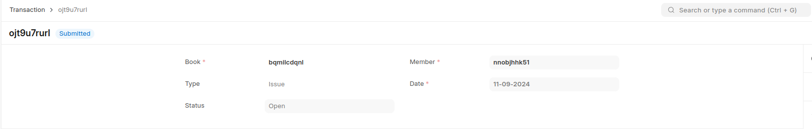

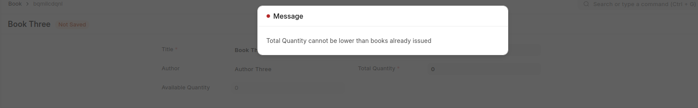

### 2. Members Management

A custom DocType - Member allows performing CRUD operations with the required fields as shown below.

Validation for outstanding debt to be not more than 500
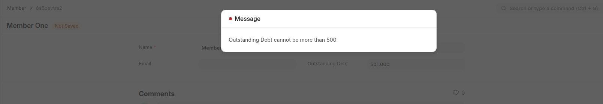

### 3. Transactions Management

A custom DocType - Transaction allows members to issue and return books as shown below.
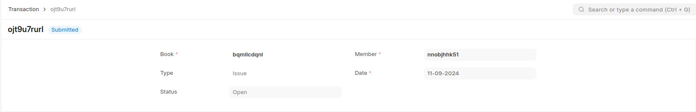
It auto-updates book stocks as shown earlier and performs various validations like -

Insufficient quantity 
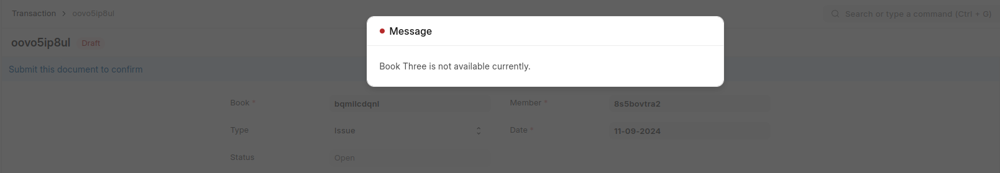
Book not issued before return

Rent fees is charged per day that the book is issued by using a daily scheduled job. Daily rent is set in a single DocType as shown below.
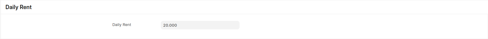
The scheduler checks all books that are currently issued and not yet returned and updates the outstanding debt of the corresponding members
daily. Below is the scheduler log for this function.
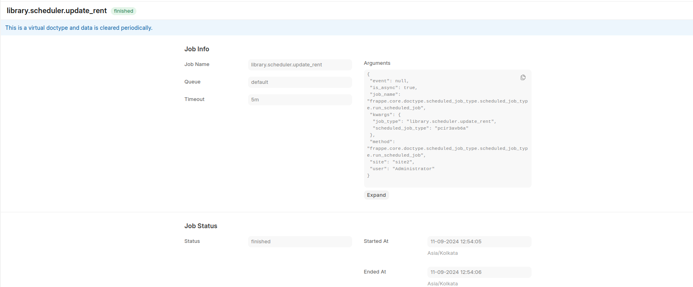
After succesful run, outstanding debt of members is updated as shown below.

### 4. Search Functionality

The system allows searching for books by title or author name as shown below
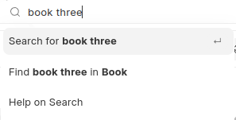
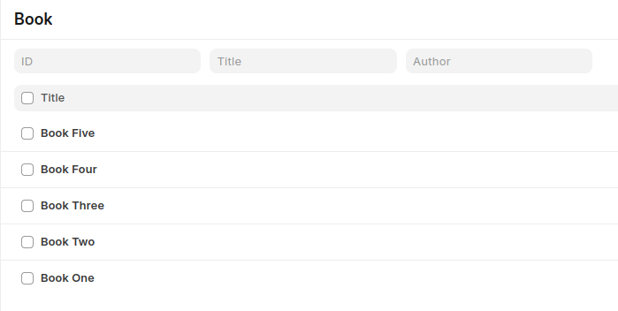
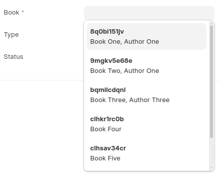

### 5. Data Import Integration

A custom API endpoint allows importing book data in bulk without any page limits as shown below.
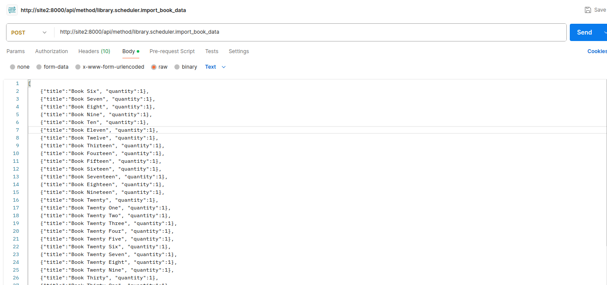
The above api call results in 30 records of the following data being imported into the Book DocType
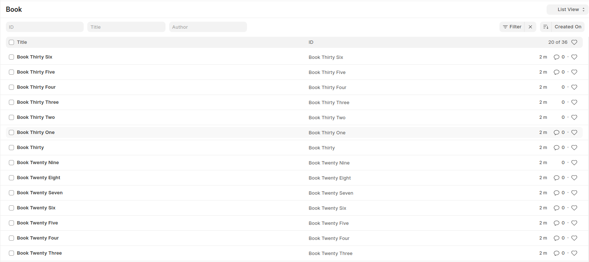
